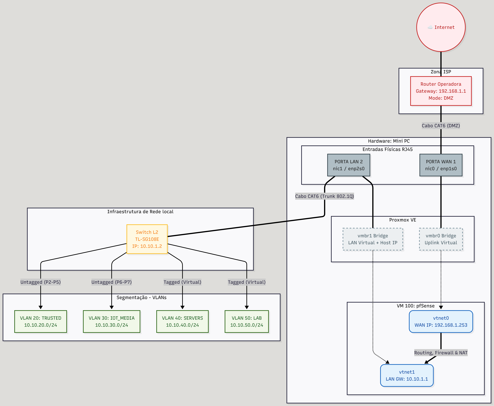

# 🛡️ DevSecOps Home Lab

## 📖 Sobre o Projeto

Este repositório documenta a construção e gestão da minha infraestrutura de laboratório pessoal (**Home Lab**).

O objetivo principal é simular um ambiente empresarial real (**Enterprise-Grade**), saindo da configuração doméstica padrão para uma arquitetura baseada em **Segurança Ofensiva/Defensiva**, **Segmentação de Rede** e **Automação**.

Aqui centralizo toda a documentação desde instalações, configurações de rede, scripts de manutenção e código de infraestrutura (IaC).

## 🗺️ Arquitetura de Rede

Abaixo encontra-se o diagrama da topologia física e lógica implementada, destacando a separação entre o Hardware, a Camada de Virtualização e a Segmentação via VLANs.

---

## 🏗️ Stack Tecnológica

A infraestrutura é desenhada para ser resiliente e escalável, utilizando tecnologias padrão da indústria:

* **Virtualização:** Proxmox VE.
* **Segurança de Rede:** pfSense (Firewall Virtualizada, VLANs).
* **Hardware de Rede:** Switch L2 Gerível (Implementação de 802.1Q).
* **Serviços:** Docker & Docker Compose (Self-hosted apps).
* **Automação:** Bash Scripting (Bootstrap), Ansible e Terraform.

---

## 📂 Como está organizado?

A estrutura de pastas segue uma lógica de separação de responsabilidades:

| Pasta | O que contém? |
| :--- | :--- |
| **`docs/`** | **Manuais e Arquitetura.** Tudo o que é para leitura humana: diagramas, guias de instalação passo-a-passo e notas de hardware. |
| **`scripts/`** | **Automação.** Scripts prontos a correr (Bash/Python) para configurar servidores ou realizar manutenções rápidas. |
| **`network/`** | **Rede.** Backups sanitizados do pfSense e tabelas de regras de firewall. |
| **`infrastructure/`** | **Provisionamento (IaC).** Código (Terraform/Ansible) que cria as máquinas virtuais automaticamente e configura os serviços. |
| **`services/`** | **Aplicações.** Configurações dos serviços que correm no laboratório (ex: Vaultwarden, Monitorização). |

---

## 🔐 Princípios de Design

Este laboratório não é apenas "instalar e usar". Segue princípios estritos de engenharia:

1.  **Zero Trust Networking:** Todo o tráfego entre redes (VLANs) é bloqueado por defeito. Apenas o estritamente necessário é permitido.
2.  **Infrastructure as Code:** Evitar configurações manuais. O objetivo é definir a infraestrutura em código para ser reprodutível.
3.  **Segurança em Camadas:** Hardening aplicado desde a BIOS, passando pelo Sistema Operativo, até à Camada de Aplicação.

---
*Mantido por **Ricardo Santos**.*