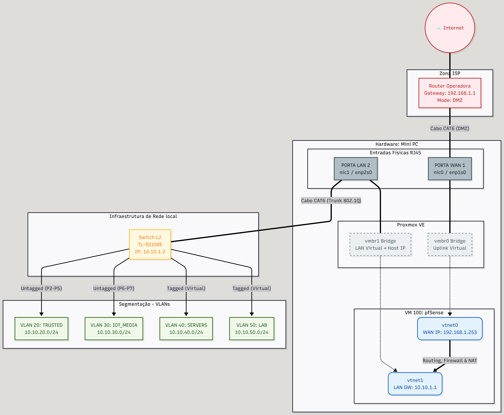

#  DevSecOps Home Lab
 

 

 

## Sobre o Projeto
 
Este repositório documenta a construção e gestão da minha infraestrutura de laboratório pessoal (**Home Lab**), montada num único Mini PC com Proxmox VE.
 
O objetivo é simular um ambiente empresarial real: segmentação de rede por VLANs, firewall dedicado, backup automatizado, automação de servidores (IaC) e deployment de serviços via Docker com um pipeline de CI/CD próprio em GitHub Actions — tudo documentado passo-a-passo à medida que construo.
 
## Arquitetura de Rede
 

 
Router da operadora → Mini PC (Proxmox VE, 2 portas de rede) → VM pfSense a gerir o routing e o firewall → Switch L2 gerível → 4 VLANs segmentadas (Trusted, IoT/Media, Servers, Lab).
 
## Stack Tecnológica
 
* **Virtualização:** Proxmox VE
* **Rede & Segurança:** pfSense (firewall virtualizado, VLANs, 802.1Q)
* **Automação (IaC):** Ansible (Playbooks de Hardening, Roles, Jinja2, Ansible Vault)
* **Acesso Remoto:** Cloudflare Tunnel + Cloudflare WARP
* **Backup:** Proxmox Backup Server (datastore ZFS)
* **Serviços:** Docker & Docker Compose — Nginx Proxy Manager, Vaultwarden, Immich, Nextcloud
* **CI/CD:** GitHub Actions — deploy automático dos serviços a partir deste repositório
* **A aprender (roadmap):** Terraform

## Como está organizado
 
| Pasta | O que contém? |
| :--- | :--- |
| **`ansible/`** | Código de automação de infraestrutura: ficheiros de inventário centralizados, variáveis encriptadas, Roles e Playbooks multiplataforma (Linux/Windows). |
| **`docs/`** | Documentação passo-a-passo: hardware, instalação e hardening do Proxmox, rede/pfSense/VPNs, Ansible IaC, pipeline Docker/GitOps, estratégia de backups. |
| **`images/`** | Diagramas de arquitetura. |
| **`scripts/`** | Scripts de automação (Bash) — ex: hardening do Proxmox. |
| **`templates/`** | Templates de deployment reais: workflow de CI/CD (`.github/workflows/deploy.yml`) e docker-compose de cada serviço (`apps/immich`, `apps/nextcloud`, `apps/npm`, `apps/vaultwarden`). |
 
## Princípios de Design
 
1. **Zero Trust Networking:** tráfego entre VLANs bloqueado por defeito, só o estritamente necessário é permitido.
2. **Infrastructure as Code (IaC):** Redução de configurações manuais a cliques. O provisionamento de base e hardening de servidores é feito via Ansible, e os serviços são geridos via Docker Compose + CI/CD.
3. **Segurança em Camadas:** hardening desde o sistema operativo (Ansible e Bash) até à camada de rede (pfSense, VLANs) com gestão de segredos (Ansible Vault).

## Roadmap
 
- Provisionamento declarativo com Terraform
- Expandir monitorização (métricas + alertas)

---
*Mantido por **Ricardo Santos**.*
