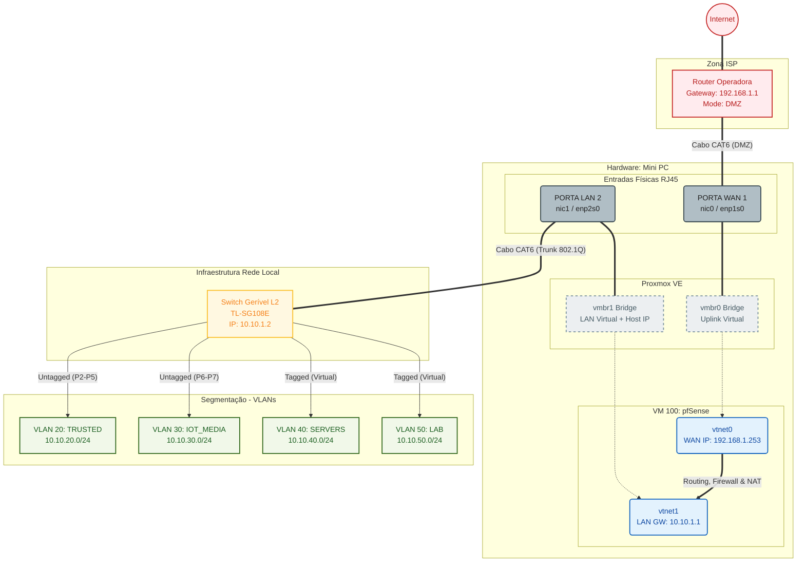

# Infraestrutura de Rede & VM pfSense

> [!ABSTRACT] Objetivo
> Preparar o Proxmox (Host Networking), criar a VM para o pfSense e configurar o Router da Operadora (DMZ + DHCP Estático).
> **Estratégia:** Preparar toda a parte física e virtual antes de instalar o software.

## 1. Configuração de Rede (Host)

O objetivo é ativar a `nic1` como a nova porta de gestão (LAN) antes de a transformar numa porta do pfSense.

**Ação:** Aceder a `Datacenter > [Node] > System > Network`.

### 1.1 Tabela de Planeamento (Alvo Final)

| Interface | Tipo | Porta Física | IP Temporário (Host) | IP Final (Host) | Comentário (Etiqueta) |
| :--- | :--- | :--- | :--- | :--- | :--- |
| **vmbr0** | Bridge | `nic0` | `192.168.1.200` (Atual) | *(Vazio)* | `WAN-UPLINK` |
| **vmbr1** | Bridge | `nic1` | `10.10.1.254` (Novo) | `10.10.1.254` | `LAN-TRUNK` |

### 1.2 Instruções de Configuração

* **Ativar Interfaces Físicas:**
    * Verificar se `nic0` e `nic1` têm **Active: Yes**.
    * Se não, clicar em **Edit** e marcar **Autostart**.
    * *Motivo:* Garante que as portas levantam fisicamente no arranque.

* **Criar a LAN (`vmbr1`):**
    * Criar nova **Linux Bridge**.
    * **Name:** `vmbr1`
    * **Bridge ports:** `nic1`
    * **IPv4/CIDR:** `10.10.1.254/24`
    * **Gateway:** (Deixar vazio para não conflituar com a `vmbr0`).
    * **Comment:** `LAN-TRUNK`
    * **VLAN Aware:** `Sim` (Check).
    * *Motivo:* Cria a nova "porta de entrada" segura para o Proxmox.
    * **Aplicar:** Clicar em **Apply Configuration**.

> [!TIP] Teste de Segurança
> Antes de avançar, ligar um cabo da `nic1` ao PC (configurar o PC com IP manual `10.10.1.50`) e tentar aceder a `https://10.10.1.254:8006`. Se funcionar, a porta de emergência está pronta.

---

## 2. Criação da VM (Hardware Tuning)

**Ação:** Clicar em `Create VM`.

### 2.1 Separador General
* **Name:** `pfSense-Firewall`
* **VM ID:** `100`
* **Start at boot:** `Sim` (Ligar automaticamente em caso de reinicio)

### 2.2 Separador OS
* **ISO Image:** (Selecionar ISO pfSense)
* **Guest OS:** `Other` (pfSense é FreeBSD).

### 2.3 Separador System
* **Machine:** (Estabilidade máxima) `i440fx` (ou q35 se precisar de PCIe Passthrough).
* **SCSI Controller:** (Menor overhead CPU) `VirtIO SCSI`
* **Qemu Agent:** (Monitorização Host) `Sim`

### 2.4 Separador Disks
* **Bus:** (Performance) `VirtIO Block`
* **Storage:** `local-lvm`
* **Size:** (OS + Logs) `10 GiB`
* **Discard:** (TRIM/Vida útil SSD) `Sim`

### 2.5 Separador CPU (Crítico)
* **Cores:** (Mínimo p/ 1Gbps) `2`
* **Type:** (Obrigatório p/ AES-NI) `Host`

### 2.6 Separador Memory (Estabilidade)
* **Memory:** `2048 MiB`
* **Ballooning:** (Desmarcar) `Não` (pfSense prefere memória fixa).

### 2.7 Separador Network (WAN)
* **Bridge:** (Ligação direta ISP) `vmbr0`
* **Model:** (Drivers 10Gbps+) `VirtIO (paravirtualized)`
* **Firewall:** (Firewall gerida pelo pfSense) `Não` (Desmarcar)

### 2.8 Pós-Criação (Adicionar LAN)
A VM é criada apenas com uma placa. Adicionar a segunda placa (LAN) antes de iniciar.

1.  Ir a **Hardware** da VM `100`.
2.  Clicar em **Add** > **Network Device**.
3.  Configurar:
    * **Bridge:** (Rede Interna Gestão) `vmbr1`
    * **Model:** (Performance) `VirtIO (paravirtualized)`
    * **Firewall:** `Não`

---

## 3. Configuração Router ISP (DMZ & DHCP)

**Ação:** Vincular o hardware virtual ao Router físico para garantir tráfego direto.

### 3.1 Obter MAC Address
1.  No Proxmox, selecionar a VM `100` > **Hardware**.
2.  Identificar a interface **net0** (Bridge: `vmbr0` / WAN).
3.  Copiar o endereço MAC (ex: `BC:24:11:XX:XX:XX`).

### 3.2 Acesso ao Router
* Ligar o PC à rede da Vodafone (Cabo ou Wi-Fi).
* Aceder ao Gateway: `http://192.168.1.1`
* Fazer Login.

### 3.3 Reserva de IP (Static DHCP)
1.  Navegar até **Definições** > **LAN - IPv4**.
2.  Procurar a secção **DHCP estático - rede local**.
3.  Adicionar novo IP:

> [!TIP] Dados da Reserva
> * **Endereço MAC:** (Colar o MAC da Interface WAN `net0` obtido no passo 3.1)
> * **Endereço IP:** `192.168.1.253`

### 3.4 Configuração DMZ
1.  Procurar a secção **Internet**.
2.  Entrar na opção **DMZ**.

> [!TIP] Configuração
> * **Função DMZ:** `Ativado / On`
> * **Endereço IP local (Target):** `192.168.1.253`

* **Confirmar alterações.**

> [!WARNING] Nota Crítica
> Não atribuir este IP (`192.168.1.253`) a nenhum outro dispositivo manualmente. Ele pertence exclusivamente à WAN do pfSense.
